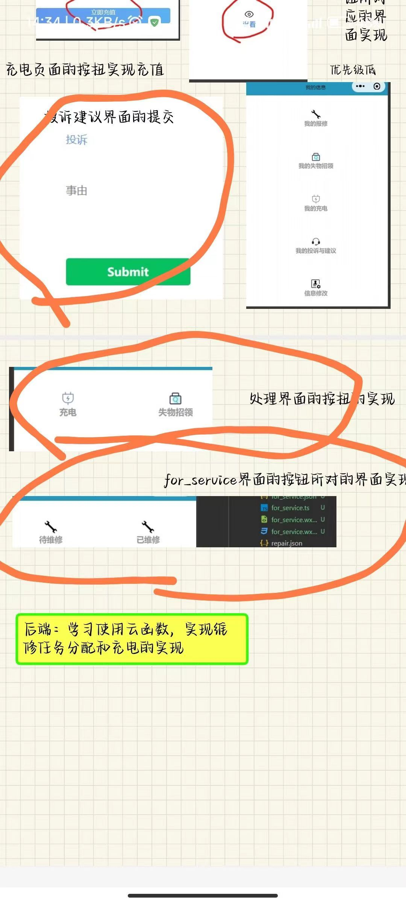
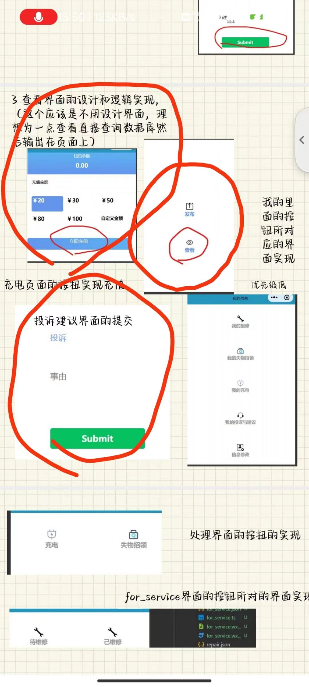
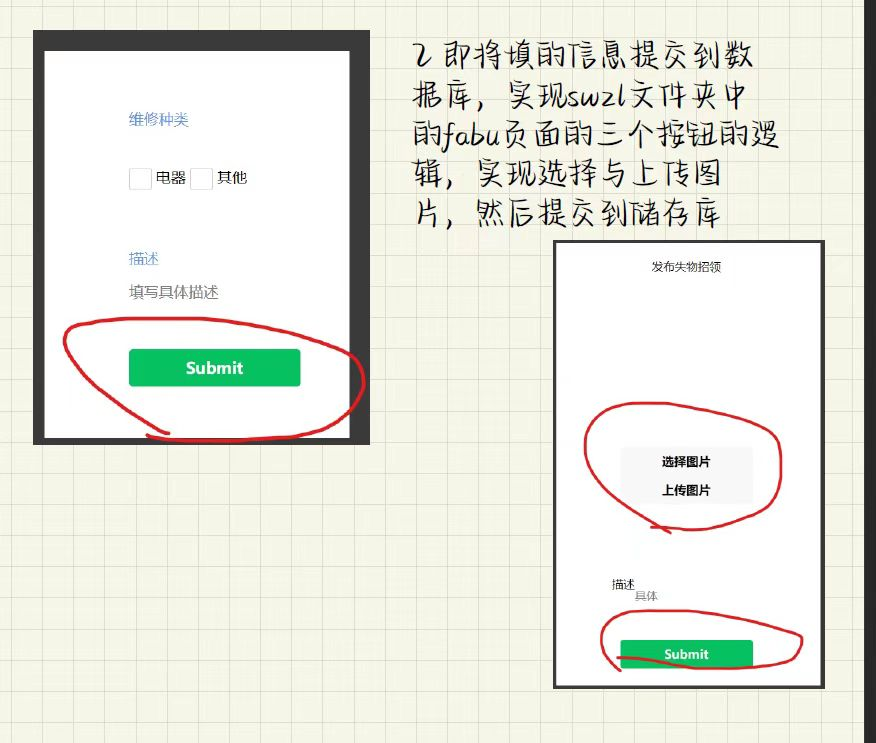

# 小程序的文档

# 核心目的，最关键的目的
想把这个做完，做好，并且在展示的时候能够装个大逼。其中最主要的还是装个大逼。。。

其次呢，我是想创造一些东西，能够真正的创造属于自己的快乐。

还有呢，想学东西，学东西以后找工作啊有用。

还有呢，证明自己的实力和能力，真真正正能做点东西出来。

# 那么我该如何实现我的目的呢
- 评估现状
- 评估自身水平
- 把两者的差距补上
- 然后就完成啦

# 那么现状是什么样呢
的的确确分下去的任务他们做完了也交了，这是大前提

但是呢，其中真正能直接用的，能满足我的要求的很少，大部分是需要修改的，所以我很头疼。同时其中还有东西是我不会的，导致我没信心完成。

# 我准备的解决方案
利用我原先的代码，从他们做的东西之中进行复制黏贴，最后完成我们的作品。

# 解决方案的实施过程中的问题解决
- 根据用例来一个个实现？也就是根据功能来实现。
  

# 落到实处
1. 我整体要变吗，ui肯定要优化，是在什么时候优化，怎么优化
2. 我的后端什么时候能实现，我的前端分出去的快十个任务什么时候能够真正调通
3. 我怎么一个个来解决这些问题

由于我的大脑内存的问题，所以我要注重记录，注重中间值的存储，这样子我就不至于内存丢失，导致从头来，这样子工作效率极其低下。

- ui在我实现完前后端后再改
- 我先把前端的改完，后端的据我估计应该也不行
- 前端先改李负责的范围
- 之后是周
- 再改张的
- 然后把登录的ui改了，之后的界面进行优化

他们的任务图

这是李的

这是周的

这是张的

# 小记一下
- 现在的问题是无法写入数据库，那个提示是成功了
- 又出现一个新问题，就是数据库索引还没建。。这个不急！
- wxss统一最后改！！！！

# 现在的问题是
- 学生充电还没实现，要加一个提交申请，充值是一回事，提交充值申请是一回事
- 阿姨看充电需求和师傅看维修需求是一样的，查询，列出来，然后可以打勾，打勾就表示做完了
- 先把数据库索引搞了，然后写好查询语句
- 现在好乱，内存不够用了
- **首先是好像学生所有功能都完成了，除了那个把失物招领的东西打勾**
- 数据库到底要不要设索引？（好像不设也能查询？）
- 搞清楚现在的需求，相当于做那个订单查询然后可以通过button进行状态修改
- 现在最主要的问题是怎么做那个订单查询，我剩下的就查这个了，如果这个做好能够解决所有剩余案例
- 他妈的，那个被我改坏了，得重新写发布了。研究一下人家的来改改把，实在受不了了
- 小程序的版本提交有问题，git还有些没搞明白

# 停下来有点领悟
1. 要学会使用工具进行工作，有简单的就不要用难得，这是人类最强大的能力，会用工具
2. 最重要的目的是把任务完成，东西做完，而不是十足的掌握，在做东西的过程中自然会加深掌握，不要太苛求
3. 学会focus问题，不能一有阻碍马上跳到别的地方！！！！！！！！！！

# 之后需要完成的部分

- ~~注册界面的实现~~
  - 预计是有一个账号框一个密码框，一个选角色的
  - 密码没有要求
  - 传到user库一份，注意字段，传到分角色的库，供登录验证使用

- 查询页面的优化
  - 查询语句是完成了，选择字段输出也实现了，其中要注意的是统一数据库的字段，这样输出就没压力了
  - 另外要美化一下输出界面！！！
  - 还有重要的是失物招领那个，把图片也下载输出！！！这个很重要

- 把wode这个文件夹删除？因为用例里没有，不是硬性要求。

-  整体ui美化
   -  统一颜色
   -  统一按钮样式
   -  统一图标
   -  布局优化！！！！！！！

- 后端实现！！！

阿姨的充电查询
失物招领的查询时图片下载
美化查询
