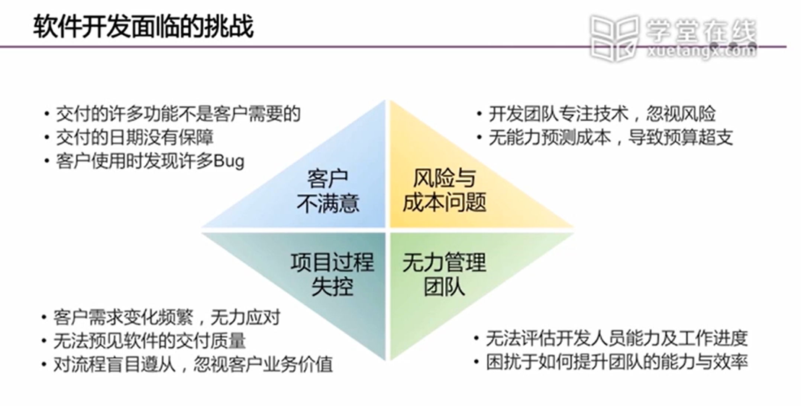
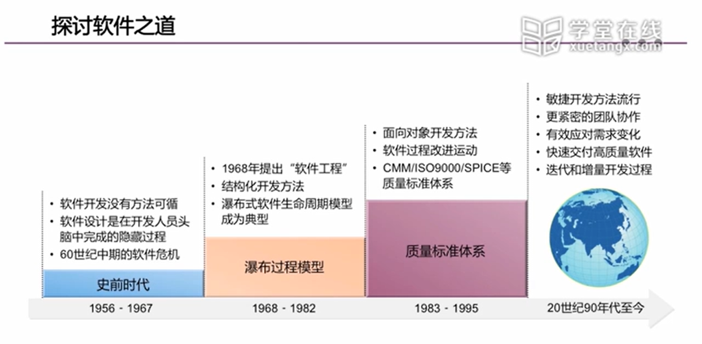
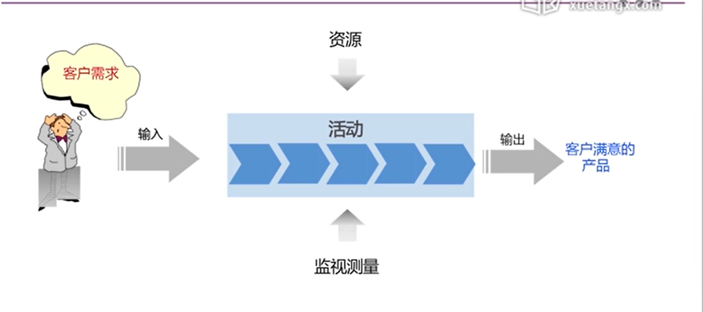
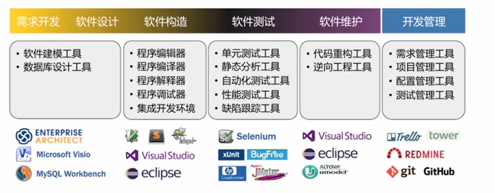

# 软件工程笔记1

# 软件工程第一章

## 软件工程无处不在  
  
  软件工程分为软件和工程两个部分。软件是软件工程研究的对象，也是软件工程的产品形态与客观存在。
  
  **工程**是将理论和知识应用于实践的科学，其目的是经济有效地解决实际问题。软件工程是为了解决开发成本效益和软件质量的问题而产生的。倡导以工程的原理和原则进行软件的开发，用系统的可控的和有效的方式构建高质量的软件产品。

## 软件的本质特性  
  ### 软件的定义:&ensp;软件 = 程序 + 数据 + 文档

  - 程序:&ensp;按事先设计的功能和性能需求执行的指令序列 , 是可执行部分。
  
  - 数据:&ensp;是程序能正常操纵信息的数据结构 , 是不可执行部分。
  
  - 文档:&ensp;与程序开发, 维护 和 使用有关的图文材料 , 是不可执行部分。

## 软件具有复杂性、一致性、可变性、和不可见性等固有的内在特性

  - 复杂性:&ensp;软件可以说是人类创造的最复杂的物体。

  - 一致性:&ensp;不能单独存在，要依附一定的环境，需要遵从人为惯例并适应已有的技术和系统。

  - 可变性:&ensp;软件在不停地版本更新，但是要注意修改带来的副作用，不断地修改可能导致软件的退化，最后结束生命周期。

  - 不可见性:&ensp;看不见摸不着的逻辑实体，不具有空间的形体特征。
    - 代码不是程序。
    - 开发人员看不到代码的执行过程

## 软件工程的产生与发展

  - 软件开发面临哪些主要的问题:
  
<!--  -->

&ensp;&ensp;&ensp;正是因为软件开发的过程中会遇到很多的困难，因此软件工程应运而生

软件工程致力于探索软件开发问题的解决之道

## 软件工程的发展史

<!--  -->

 

## 软件工程的基本概念

  - 工程的含义:
    
    工程是将理论和知识应用于实践的科学，以便经济有效地解决问题。

  - 什么是软件工程

    软件工程是将系统性的、规范化的、可定量的方法应用于软件的开发、运行和维护,即工程化应用到软件上。

  - 软件工程的目标 —— 创造足够好的软件。

  - 软件工程的过程
    
    <!--  -->

  - 软件工程方法

    &ensp;&ensp;&ensp;面向服务：在应用表现层次上将软件构件化，即应用业务过程由服务组成，而服务由构件组装而成。

    &ensp;&ensp;&ensp;面向过程：以算法作为基本构造单元，强调自顶向下的功能分解，将功能和数据进行一定程度的分离。

    &ensp;&ensp;&ensp;面向对象：以类为基本程序单元，对象是类的实例化，对象之间以消息传递为基本手段。

    &ensp;&ensp;&ensp;面向构件：寻求比类的粒度更大的且易于复用的构件，期望实现软件的再工程。

   - 软件工程工具

  <!--  -->

  - 软件开发的基本策略
    
    ### 软件开发的基本策略有软件复用，分而治之，逐步演进，优化折中。

  - 软件复用：构造一个新的系统不必从零做起，直接复用已有的构件进行组装构件是经过反复使用验证的，由其组成的新系统具有较高的质量。软件复用不仅仅是代码复用，还包括 库函数、类库、模板（文档、网页等）、 设计模式 、组件 、框架。

  - 分而治之：将一个复杂的问题分解成若干个简单的问题，然后逐个解决来源于人们生活与工作的经验，完全适合于技术领域。

  - 逐步演进：软件更像一个活着的植物，其生长是一个逐步有序的过程。软件开发应该遵循软件的 客观规律，不断进行迭代式增量开发，最终交付符合客户价值的产品。

  - 优化折中：软件工程师应当把优化当成一种责任，不断改进和提升软件质量；但是优化是一个多 目标的最优决策，在不可能使所有目标都得到优化时，需要进行折中实现整体最优。

## 业界人士谈软件工程

- 软件工程的开发不是一个人的工作，是很多人把自己的智慧和代码集合在一起，软件工程让很多人把自己的使用习惯都归结成一些规则，让每个人写出来的代码都是同样的思维，同样的思路，看起来像一个人写出来的代码，这就是设计模式。

- 业界人士认为程序员最重要的四个素质

  - 1、拥有极强的代码的阅读和理解的能力，以及书写代码的能力

  - 2、有极强的责任心和责任感，对整个软件产业的敬畏之心（对前人和用户的体验的敬畏，自我反省，自我提升）

  - 3、有职业道德，对代码的品质的保证和对整个公司秘密的保护

  - 4、需要有和其他程序员协同的能力，人与人之间的相处，人与人之间如何交换自己的代码，开发的心得，开发的经验

