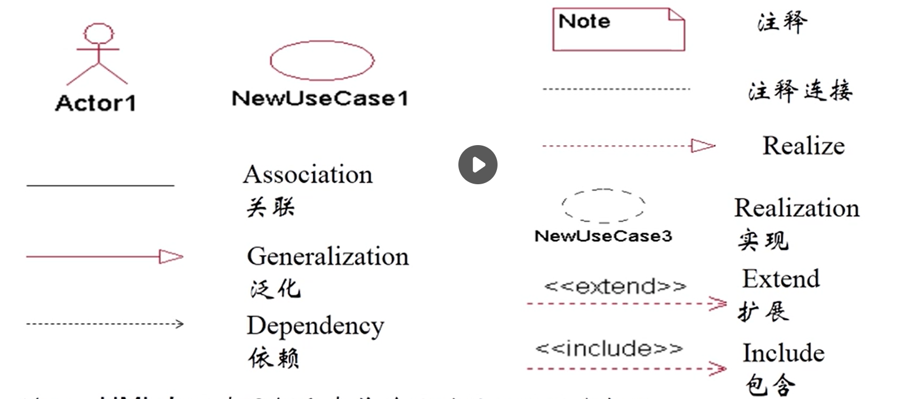
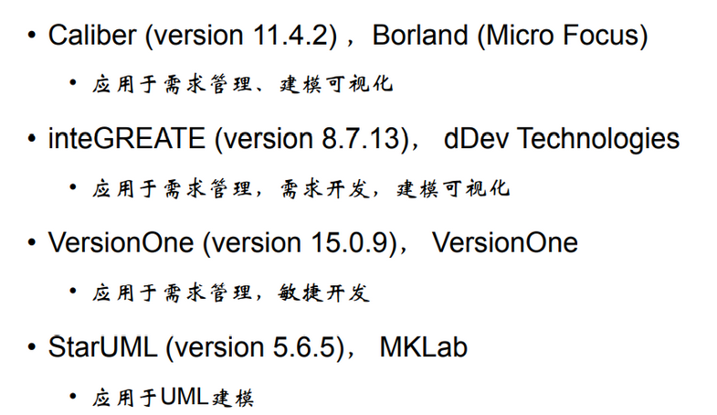

# 软件工程笔记3

# 用例建模概念

## 什么是用例

1. 定义系统的一系列行为 通过此可为参与者提供有价值且可观测的结果。
2. 定义一个参与者要用到的系统功能
3. 描述系统为实现参与者价值所开展的行为序列
4. 对参与者与系统之间的交互活动进行建模
5. 从特定的用户角度出发，是完整的，实现特定用户价值的事件流

### **参与者**

- 与系统交互的人

- 与系统交互的硬件组件或者其他的外部系统

- 关注的重点是所承担的“角色”

- 参与者的名要明确定义其角色

### **关联**

- 参与者与用例之间的交互通道

- 用一条直线表示交互——**关联**

- 有箭头的**关联**指出是谁发起的交互

- 没有箭头则表明双方都可以发起交互

# 用例建模过程

## 首先

1. 找到所有的参与者和用例

2. 识别出参与者并做简单的描述

3. 识别出用例并做简单的介绍

## 其次

1. 编写用例，列出用例

2. 给用例事件流程划分重要等级

3. 按照重要程度排序详细描述事件流程

# 用例建模精讲

## 设定系统边界
系统边界—：一个系统所包含的所有系统成分与系统以外各种事物的分界线。

系统边界会对用例以及actor的定义有影响

## 用例与功能分解的区别
- 功能分解：将问题分解为粒度小，独立的部分

- 用例
  - 不是功能分解的过程
  - 综合所有功能一起藐视系统如何使用
  - 需要包含语境信息

## 用例图用到的主要图标

## 建模工具介绍
常用的系统建模工具

