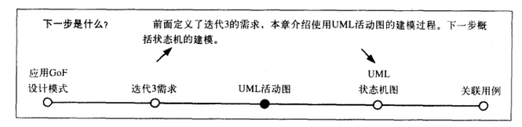
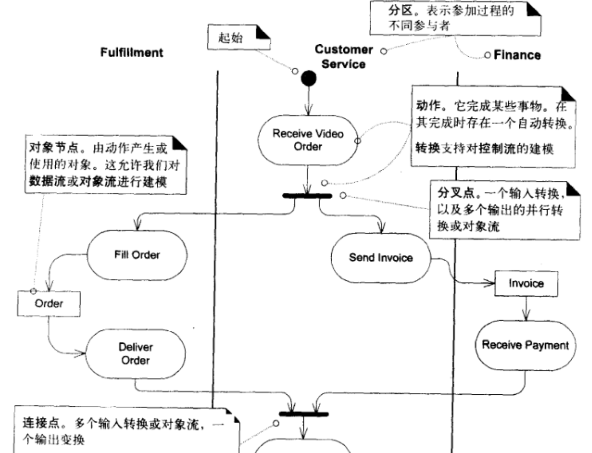
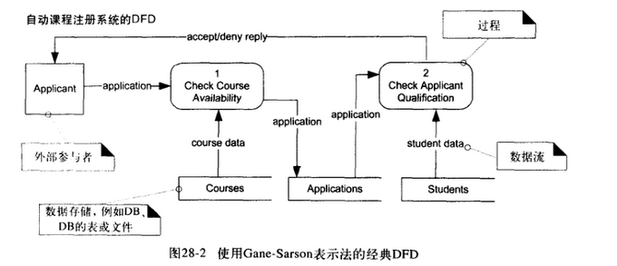
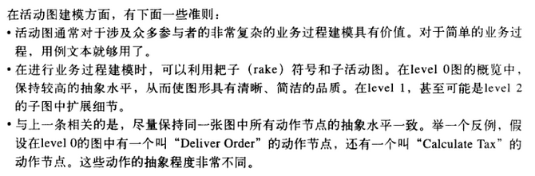
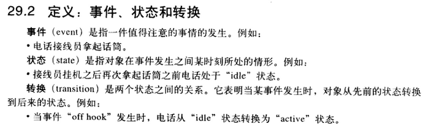

# 软件工程笔记4

# UML活动图
- 一个UML活动图表示一个过程中的多个顺序活动和并行活动。

- 这些活动图有助于业务过程，工作流，数据流和复杂算法进行建模

## 重要组成
- 动作
- 分区
- 分叉点
- 连接点
- 对象节点

## 业务过程建模

## 数据流建模

**记录主要数据流或进行较高层面的数据流设计**

## 准则

# UML状态图
**描述某个对象的状态和感兴趣的事件以及对象相应该事件的行为**

# 一点想法

对于这个状态图，教程是真没看懂。。
还是需要和同学讨论讨论
